# GitHub Copilotin peruskäyttö ja Agent Mode

Tämä opas on tarkoitettu aloittelevalle GitHub Copilotin käyttäjälle, jolla on jo kokemusta ohjelmoinnista. Esimerkeissä käytetään C#-ohjelmointikieltä, mutta kuvattuja menetelmiä voi soveltaa myös muilla ohjelmointikielillä.

## Sisältö

Tässä oppaassa kerrotaan, miten tekoälypohjaista GitHub Copilot -koodiavustinta ja sen Agent Mode -toimintoa käytetään Visual Studio Codessa. Esimerkkisovellukset tehdään C#-ohjelmointikielellä.

Oppaassa kerrotaan seuraavista Copilotin käyttöön liittyvistä asioista:
- Miten automaattinen koodintäydennys toimii
- Kehotteiden antaminen kommenttien ja Inline Chatin kautta
- Chat-ikkunan käyttö koodin selittämiseen
- Agent- ja Plan-moden käyttö koodin muokkaamisessa ja generoimisessa.

## GitHub Copilot

GitHub Copilot on tekoälyyn pohjautuva ohjelmointityökalu, joka osaa luoda ja täydentää ohjelmakoodia. Copilotille kuvataan ohjelmointitehtävä luonnollisella kielellä ja se tuottaa ratkaisun annettuun tehtävään valitulla ohjelmointikielellä. Haluttu uusi ohjelman toiminto voidaan kuvata esimerkiksi Inline Chat -ikkunassa tai kuvaus voidaan kirjoittaa ohjelmakoodin kommentteihin. Copilot osaa myös ehdottaa seuraavia koodirivejä samalla, kun ohjelmoija kirjoittaa ohjelmakoodia. Copilot osaa generoida myös suurempia koodikokonaisuuksia, jotka jakaantuvat useisiin ohjelmistomoduuleihin. GitHub Copilot toimii muun muassa Visual Studio Codessa (VS Code) ja Visual Studiossa.

Copilotia markkinoidaan tekoälypohjaisena pariohjelmoijana, jolta voi kysyä ohjeita ohjelmointityön aikana. Copilotia voi pyytää myös selittämään annettua ohjelmakoodia tai virheilmoituksia. Virhetilanteissa Copilot selittää ongelman ja antaa korjausehdotuksen. Copilot on myös hyödyllinen yksikkötestien laatimisessa. Copilot toimii parhaiten, kun sille on annettu tietoa kehitettävän ohjelman kontekstista. Käytännössä tämä tarkoittaa sitä, että Copilotille kerrotaan, mitä ohjelmakoodia sen tulee huomioida koodiehdotuksia varten. 

## GitHub Copilot Agent-mode

GitHub julkaisu marraskuussa 2024 Edits-toiminnon GitHub Copilotiin. Edits-toiminto muistuttaa Chat-ikkunaa, mutta Copilot Edits osaa tehdä ehdottamansa muutokset suoraan ohjelmakooditiedostoihin. Copilot Edits -toiminnosta on kerrottu [täällä](https://github.com/SeAMKedu/CopilotTutorial).

Alkuvuodesta 2025 esitelty Agent-mode laajentaa Edits-modea (nykyään Edit). Edit-mode keskittyy yksittäisiin koodimuutoksiin, kun taas Agent Moden avulla voidaan tehdä suurempia muutoksia ohjelmakooditiedostoihin vaiheittain. 

Agent Mode tuo "agenttimaisen" toiminnallisuuden VS Codeen. Koodiehdotusten lisäksi se osaa tekemään laajempia koodaustehtäviä vaiheittain. Agentti pystyy lukemaan tiedostoja ja muokkaamaan projektin tiedostoja sekä ajamaan komentoja terminaalissa. Agentti toimii vuorovaikutteisesti ohjelmoijan kanssa. Työn kulku menee siten, että ohjelmoija antaa Colpilotille tavoitteen ja agentti laatii suunnitelman ja vie prosessia eteenpäin. Agentti etenee pienin askelin ja antaa statuspäivityksen muutaman toimenpiteen välein. Agentti pyytää käyttäjää vahvistamaan muutosehdotukset ja komentojen ajon terminaalissa. 

## GitHub Copilotin asentaminen VS Codeen

GitHub Copilotia varten tarvitaan Visual Studio Code ja GitHub-tili. Asennusohjeet löytyvät sivulta [Installing the GitHub Copilot extension in your environment](https://docs.github.com/en/copilot/managing-copilot/configure-personal-settings/installing-the-github-copilot-extension-in-your-environment).

Varmista ensin, että sinulla on pääsy GitHub Copilotiin. Ohjeet ovat sivulla [Getting access to Copilot](https://docs.github.com/en/copilot/about-github-copilot/what-is-github-copilot#getting-access-to-copilot). 

Jos olet opiskelija tai opettaja, älä avaa ilmaista kokeilujaksoa. Opiskelijat saavat käyttää GitHub Copilotia yleensä ilmaiseksi. Hanki pääsy GitHub Copilotiin näiden ohjeiden avulla: [Getting free access to Copilot as a student, teacher, or maintainer](https://docs.github.com/en/copilot/managing-copilot/managing-copilot-as-an-individual-subscriber/managing-your-copilot-subscription/getting-free-access-to-copilot-as-a-student-teacher-or-maintainer).

Asenna seuraavaksi GitHub Copilot -laajennus Visual Studio Codeen: [GitHub Copilot extension](https://docs.github.com/en/copilot/managing-copilot/configure-personal-settings/installing-the-github-copilot-extension-in-your-environment).

## Esimerkkisovellus C#-ohjelmointikielellä

Tutustutaan Copilotin käyttöön tekemällä pieni esimerkkisovellus Copilotin avulla. Esimerkkisovellus käsittelee Suomen kuntien tietoja.

Harjoituksessa perehdytään ensin automaattiseen koodintäydennykseen sekä kehotteiden antamiseen Inline Chatin ja kommenttien avulla. Tämän jälkeen kokeillaan Copilotia koodin selittämiseen. Lopuksi tutustutaan Copilot Agent Modeen, jonka avulla voi tehdä useampaan tiedostoon kohdistuvia muutoksia.

### Tarvittavat ohjelmistot

Asenna seuraavat ohjelmistot, ellei sinulla ole jo niitä:

- [.NET SDK](https://dotnet.microsoft.com/download).
- [VS Code](https://code.visualstudio.com/download)
- C# Extension. Asenna tämä VS Coden laajennoksissa (Extensions).

### Projektin perustaminen

Tämä harjoitus tehdään pääosin Visual Studio Code -editorilla. Projekti kannattaa kuitenkin luoda täydellä Visual Studio -versiolla, että projektiin syntyy debuggausta varten tarvittavat tiedostot. Copilotin käyttö käytto on kuitenkin sujuvampaa VS Codessa.

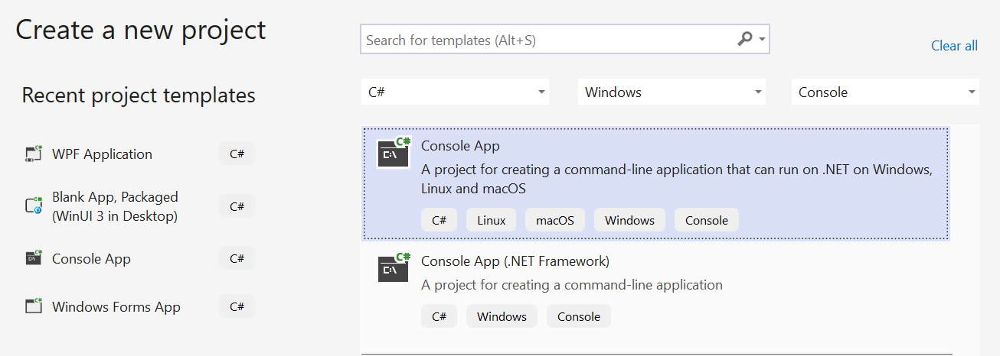

Avaa Visual Studio
- Valitse Create a new project
- Valitse Console App (Ei .NET Framework)
- Valitse Do not use top-level statements
- Paina Create
- Testaa ohjelma ajamalla se (Debug - Start Without Debugging)

Sulje Visual Studio nyt. Navigoi komentorivillä siihen hakemistoon, mihin projekti syntyi.

> [!NOTE]
> Jos et halua kuitenkaan käyttää täyttä Visual Studiota, voit tehdä projektin C#-konsolisovellusta varten terminaalista. Tämä on siis vaihtoehtoinen tapa luoda projekti:
> ```
> dotnet new console -n ReadMunicipalityData
> ```
> Komento tekee hakemiston ReadMunicipalityData ja sen alle projektitiedoston ReadMunicipalityData.csproj ja ohjelmakooditiedoston Program.cs. Ohjelmaa voi nyt kehittää VS Codella.
> Siirry seuraavaksi syntyneeseen projektihakemistoon.
> ```
> cd ReadMunicipalityData
> ```
> Voit myös kääntää ohjelman tässä vaiheessa. Tämä ei ole välttämätöntä, sillä ohjelma käännetään automaattisesti ajettaessa, jos siihen on tehty muutoksia edellisen käännöksen jälkeen.
> ```
> dotnet build
> ```

Aja seuraavaksi ohjelma komentoriviltä.
```
dotnet run
```
Käynnistä VS Code näin. VS Code avautuu samaan hakemistoon, mistä käynnistys tehtiin.
```
code .
```

### Inline chat

Tehdään seuraavaksi ohjelma, joka lukee tiedoston [kunnat2024.csv](kunnat2024.csv). Tiedoston sarakkeet ovat ID, nimi ja asukasluku. Tiedot on erotettu pilkulla.

Alkuperäinen data löytyy [kuntaliiton sivulta](https://www.kuntaliitto.fi/kuntaliitto/tietotuotteet-ja-palvelut/kaupunkien-ja-kuntien-lukumaarat-ja-vaestotiedot).

```
20;Akaa;16387
5;Alajärvi;9078
9;Alavieska;2410
10;Alavus;10780
16;Asikkala;7889
18;Askola;4651
```

Kopioi tiedosto [kunnat2024.csv](kunnat2024.csv) C#-projektin juureen samalle tasolle kuin Program.cs.

Avaa VS Codessa tiedosto Program.cs. Poista rivi, jossa tulostetaan Hello World. Avaa tähän kohtaan Inline Chat (Ctrl+I).

Anna sitten Inline chatille prompti:
```
Make a program, which reads the file kunnat2024.csv.
```

Paina seuraavaksi Inline chat ikkunan oikeassa reunassa olevaa nuolta.

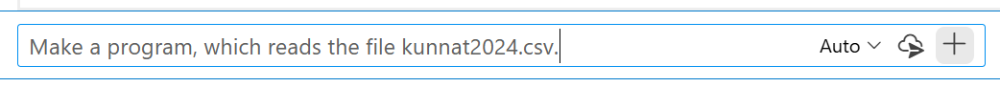

Hyväksy generoitu koodi painamalla Accept. 

Inline Chat aukeaa koodieditoriin tiedostokohtaisesti. Tekoälyn avulla käytävä keskustelu kohdistuu siis avoinna olevaan tiedostoon. Inline chatin sijaan voit antaa kehoitteen myös ohjelmakoodin kommentissa.

Inline Chatiä ei pidä sekoittaa Chat-ikkunaan, josta kerrotaan seuraavassa kohdassa.

### Chat-ikkuna

Inline Chatin lisäksi keskustelua tekoälyn kanssa voi käydä myös Chat-ikkunassa, joka avautuu ruudun oikealle puolelle omaan ikkunaansa. 

Chat-ikkunan saa auki yläpalkissa olevasta valikosta:

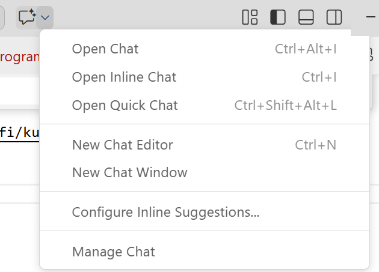

Avaa Chat-ikkuna (Open Chat). Chat-ikkunan alareunassa on laatikko (Describe what to build next), johon voit antaa prompteja.

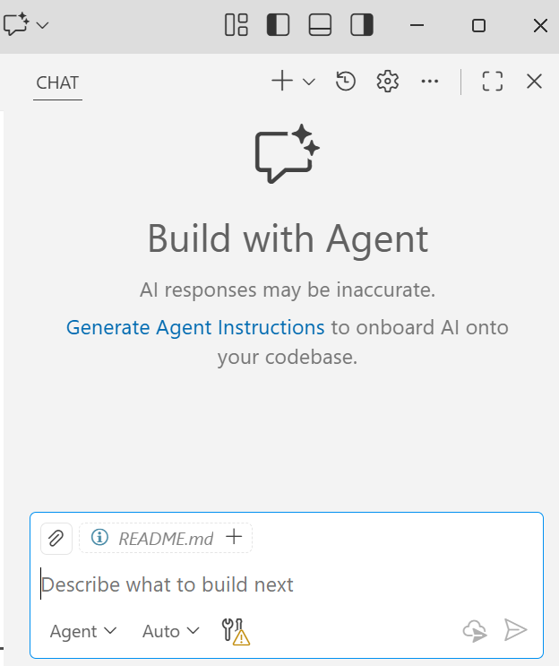

Alhaalta vasemmalta voit valita Copilotin toimintatavan. Oletusarvoisesti on valittuna Agent mode. Muut vaihtoehdot ovat Plan, Ask ja Edit.

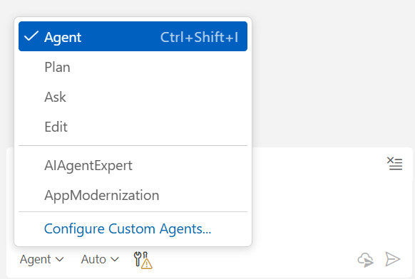

Tässä on lyhyt yhteenveto toimintatavoista:
- Agent: Auttaa suorittamaan tehtäviä, hakee tietoa ja tekee kooditiedostoihin muutoksia puolestasi. Agent voi ajaa myös komentoja terminaalissa.
- Plan: Laaditaan etenemissuunnitelma, joka jakaa tehtävän vaiheisiin ennen toteutusta.
- Ask: Perinteinen Chat-ikkuna, jossa voi kysyä selitystä ohjelmakoodiin. Tekee myös koodiehdotuksia, mutta näitä ei tehdä suoraan kopoditiedostoihin.
- Edit: Tekee muutoksia tiedostoihin suoraan, kuten Agent.

Osa toimintatavoista on päällekkäisiä ja voi olla vaikea erottaa, miten ne eroavat toisistaan. Tärkeimmät toimintatavat ovat kuitenkin Agent ja Ask. Toimintatapojen erot selviävät parhaiten kokeilemalla.

### Ask

Täydennetään ohjelmaa siten, että kustakin kunnasta luodaan Municipality-luokan olio. Oliot tallennetaan listaan. Pyydetään Copilotia tekemään myös Municipality-luokka.

Valitse alareunasta Ask-mode. Anna sitten Chat-ikkunassa prompti:
```
Create class Municipality. Fields (properties) are ID, Name and Population.
Read the file and create a list of municipalities. 
```
Copilot antaa koodiehdotuksen Chat-ikkunaan.

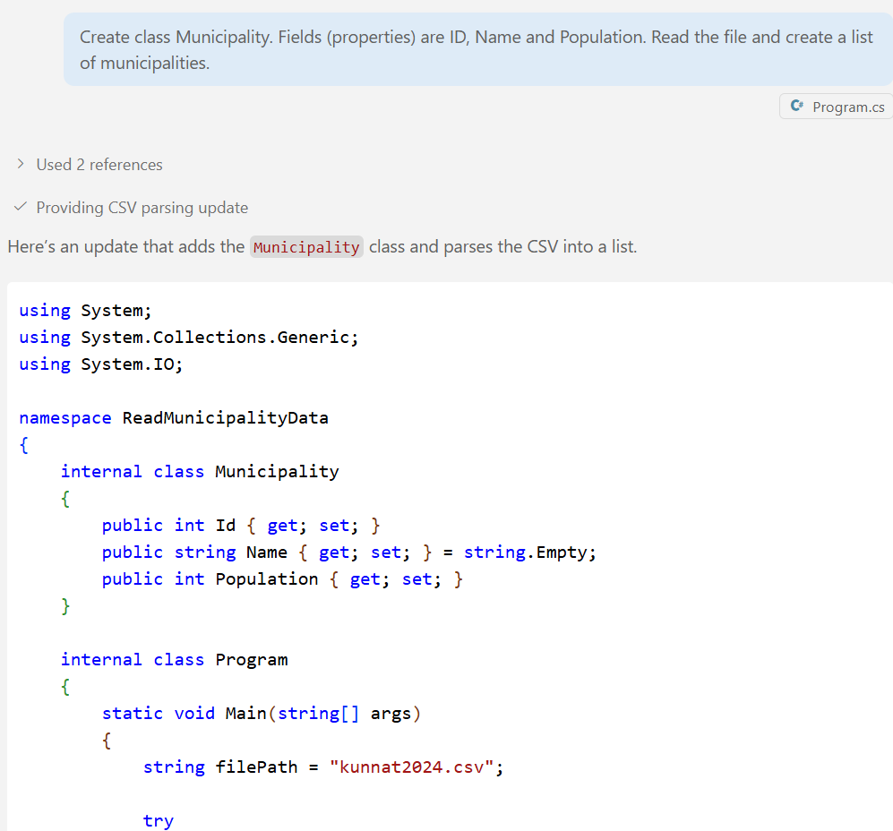

Voit tarkastella koodiehdotusta Chat-ikkunassa. Jos se on mielestäsi OK, voit kopioida sen Program.cs-kooditiedostoon kokonaan tai osittain.

Ei tehdä käsin kopiointia kuitenkaan nyt, vaan kokeillaan Plan-modea. Jätetään ohjelmakoodi siis ennalleen.

### Plan

Valitse Chat-ikkunan alareunasta nyt Plan-mode ja kopioi Chat-ikkunaan taas edellisessä kohdassa annettu prompti:
```
Create class Municipality. Fields (properties) are ID, Name and Population.
Read the file and create a list of municipalities. 
```
Copilotin Plan-mode antaa nyt yksityiskohtaisen suunnitelman siitä, miten ohjelma pitää toteuttaa.

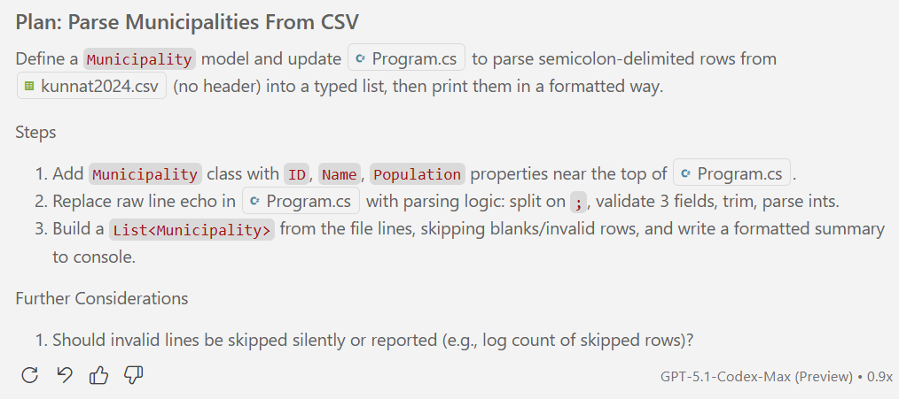

Näyttää siltä, että sinun ei tarvitse osata promptata kovin tarkasti, vaan Copilot tekee yksityiskohtaiset promptit! Tämä tehtävä on kuitenkin hyvin yleinen ohjelmointitehtävä, eikä anna oikeaa kuvaa todellisen ohjelmointiongelman ratkaisusta. 

Plan-mode tuntuu kuitenkin hyödylliseltä. Voit halutessasi muuttaa tai tarkentaa Copilotin tekemää suunnitelmaa.

Annetaan seuraavaksi prompti:
```
Skip invalid lines.
Start implementation
```
Copilot tekee nyt muutoksen suoraan ohjelmakooditiedostoon Program.cs. 

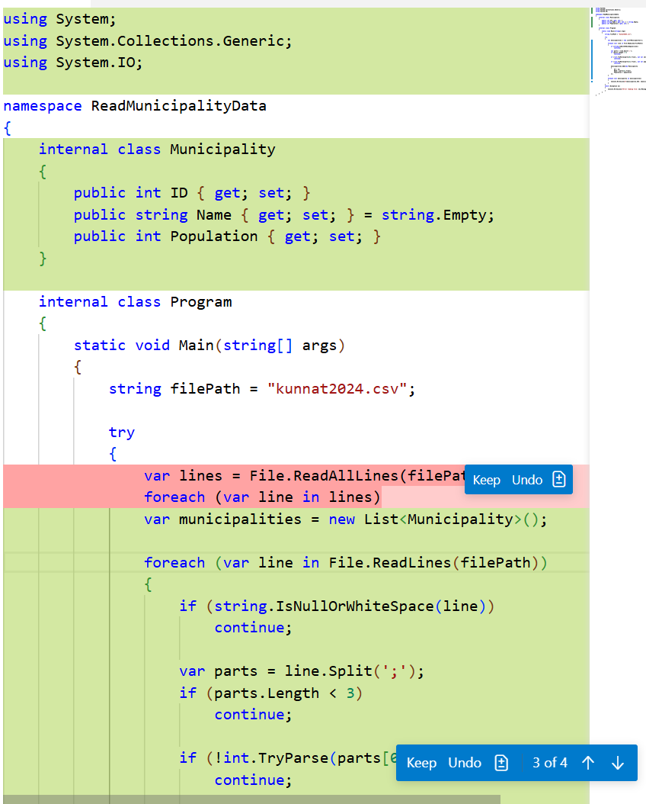

Hyväksi muutokset painamalla Keep lähdekoodi-ikkunassa.

Aja sitten ohjelma antamalla terminSaalissa komento dotnet run.

Halutessasi voit pyytää Copilotia selittämään koodia. Maalaa epäselvät koodirivit Program.cs:ssä ja kysy Chat-ikkunassa, esimerkiksi "mitä tämä tarkoittaa".

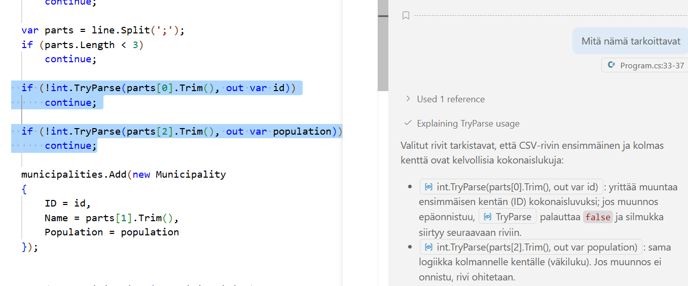

### Promptaus ohjelmakoodin kommentin kautta

Kokeile vielä promptausta ohjelmakoodin kommentin avulla. Kirjoita seuraava kommentti ensimmäisen foreach-lauseen jälkeen:
```Csharp
// Sort municipalities by population in descending order
```
Copilot ehdottaa sinulle uutta koodiriviä. Hyväksy se painamalla Tab.

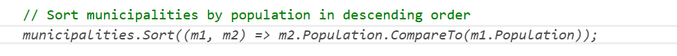

### Agent

Agent moden avulla voidaan tehdä suurempia muutoksia ohjelmakooditiedostoihin vaiheittain. Agent-mode lukee ja muokkaa projektin tiedostoja, ajaa komentoja terminaalissa ja toimii vuorovaikutteisesti ohjelmoijan kanssa. Ohjelmoija antaa tavoitteen, agentti laatii suunnitelman ja etenee pienin askelin antaen säännöllisiä tilapäivityksiä. Ennen muutoksia tai komentojen ajoa agentti pyytää käyttäjältä vahvistuksen ja mukauttaa suunnitelmaa iteratiivisesti käyttäjän palautteen perusteella. Agentti voi myös pyytää lupaa ohjelmaan ajamiseen, että se voi selvittää ajonaikaisen virheilmoituksen syyn.

Kokeillaan seuraavaksi Agent-modea käytännössä. Täydennetään ohjelmaa siten, että se hakee kuntien sijaintitiedot ja maakunnan Nominatim-palvelusta. Pyydetään Copilotia vielä siirtämään Municipality-luokan omaan tiedostoonsa.

Aseta Agent-mode chat-ikkunan alareunasta ja anna seuraava prompti:
```
Find the location and region (maakunta) of each municipality by using Nominatum service.
Make a new CSV file, which contain region, latitude and longitude in addition to the original fields.
Move the class Municipality to its own file.
```
Copilot tekee nyt muutoksia ohjelmakooditiedostoihin useassa vaiheessa ja pyytää käyttäjää hyväksymään ne.

Hyväksy kaikki muutokset ja kokeile sitten ohjelmaa terminaalissa komennolla dotnet run.

Saattaa olla, että ohjelma ei toimi ajon aikana oikein, vaan antaa virheilmoituksen. Jos käy näin, voit syöttää virheilmoitukset Copilotille esimerkiksi näin:

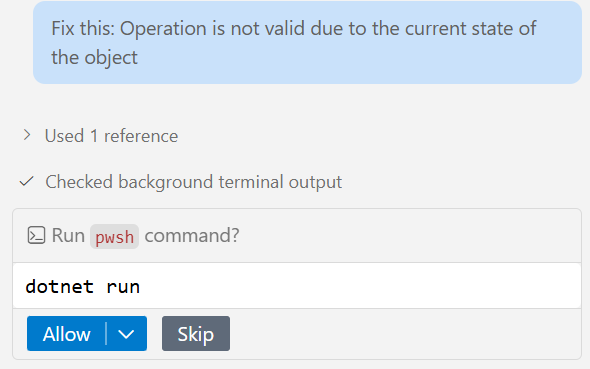

Tässä tapauksessa Copilot pyytää ajamaan vielä ohjelman uudestaan, että se voi tutkia ohjelman ajonaikaista toimintaa ja virheilmoituksia tarkemmin. Tämän jälkeen Copilot antaa korjausehdotuksen, jonka käyttäjä voi hyväksyä.

## Refaktorointi

Pääohjelma Program.cs:ssä on vielä aika pitkä. Pyydetään Copilotia muuttamaan se pienemmiksi moduuleiksi. Kokeillaan tätä Plan-modessa, että saadaan näkyviin Copilotin suunnitelma.

```
Main program is now very long.
Divide the Main function to smaller functions.
```

Copilotin Plan-mode antoi seuraavan suunnitelman:

> [!TIP]
> **Plan: Modularize Main Program**
> 
> Refactor the logic in Program.cs into smaller, focused helper methods for readability and maintainability.
> 
> **Steps**
> 1. Move CSV reading logic to a method: List<Municipality> ReadMunicipalities(string filePath)
> 2. Move Nominatim enrichment logic to a method: Task EnrichMunicipalitiesAsync(List<Municipality> municipalities)
> 3. Move CSV writing logic to a method: void WriteMunicipalitiesCsv(List<Municipality> municipalities, string outputPath)
> 4. Update Main to orchestrate by calling these helpers in order.

Suunnitelma vaikuttaa hyvältä.

Paina nyt Start implementation -painiketta (tai kirjoita Start implementation). Copilot tekee nyt muutokset ohjelmakooditiedostoon.

Ohjelma on nyt jaettu pääohjelmaan (Main) ja aliohjelmiin, joita kutsutaan pääohjelmasta. Valmis esimerkkkiohjelma löytyy hakemistosta [ReadMunicipalityData](ReadMunicipalityData).